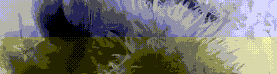

  

# ✦ Ahmed Kabbej  

✺ **Creative Technologist** · ✺ **Creative Developer** · ✺ **UI/UX Designer**  
Crafting immersive digital experiences at the intersection of design, sound, animation, and code.  
🎓 Currently studying at **Gobelins, l'École de l'Image** — graduating in **June 2026**

I design and build interactive experiences blending **front-end development**, **creative coding**, **WebGL**, and **immersive interfaces**.

---

## 🛠️ Core Skills

### Front-End Development  
`HTML5` · `CSS3` / `TailwindCSS` · `JavaScript` · `TypeScript` · `React` · `GSAP`  
`Node.js` · `Vite` · `NPM` · `Docker` · `Wordpress`

### Creative Tech & WebGL  
`Three.js` · `WebGL` · `GLSL` · `Shaders`  
`TouchDesigner` · `Blender` · `3D pipelines`

### Design & Prototyping  
`Figma` · `Adobe Suite` (Photoshop, Illustrator, Indesign, Dimension)  
Video Mapping · Motion Design · UI/UX

### Audio & Sound  
`Ableton Live` · `GarageBand` · `Logic Pro X`  
Audio-reactive visuals · Interactive sound design

---

## ⚡ What I Build

- Industrial web solution and website
- Immersive websites & artistic web experiences  
- Visual & interactive interfaces  
- Real-time audiovisual installations  
- Audio-reactive & WebGL experiments

---

## Contact

✺ [Portfolio → ahmedkabbej.fr](https://ahmedkabbej.fr)  
✺ [LinkedIn → Ahmed Kabbej](https://www.linkedin.com/in/ahmed-kabbej-ab0b612a3/)  
✺ [Email → kabbejahmed1@gmail.com](mailto:kabbejahmed1@gmail.com)
